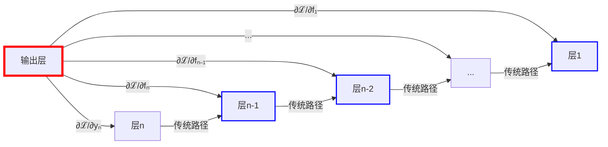
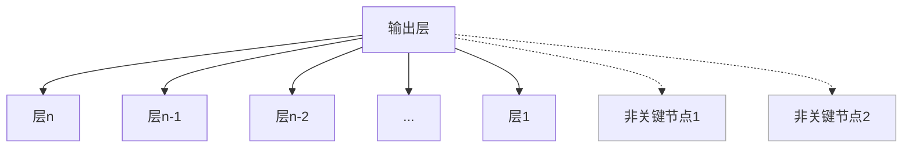
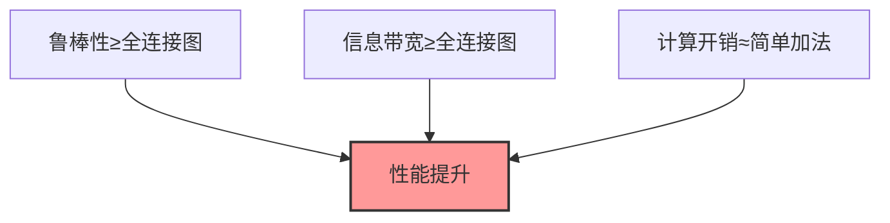
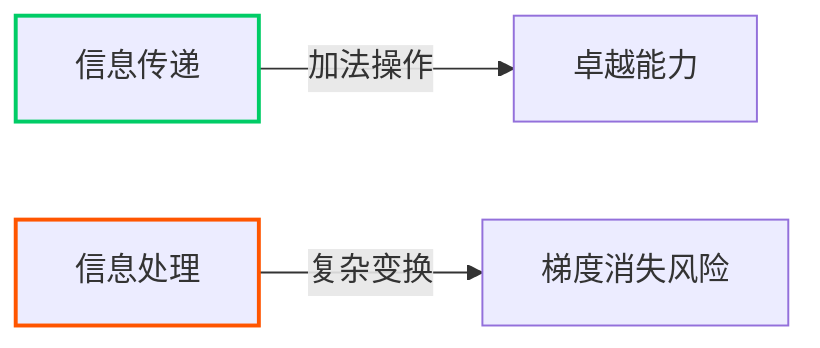
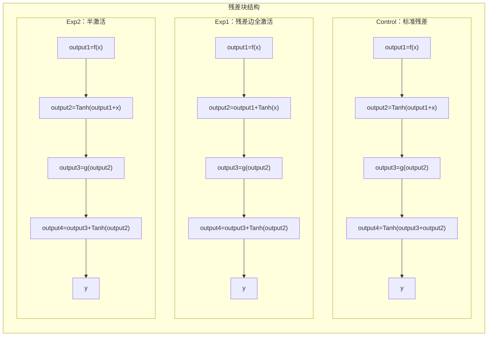

# 残差连接的图论表述：统一理论与实验验证

以下文档系统阐述了残差连接的**创新性图论框架**，该框架首次从图结构视角统一解释了残差连接的工作原理、优势本质和改进困境，并通过精心设计的实验验证了理论预测：

## 1. 引言：残差连接的神秘性
残差连接(Residual Connection)是深度学习领域的革命性创新：
- 解决了超深层网络训练的梯度消失/爆炸问题
- 催生了ResNet、Transformer等划时代架构
- 在各类任务中展现出惊人鲁棒性和性能

**核心谜题**：
> "为何如此简单的结构（`y = F(x) + x`）能解决深层网络训练难题？为何改进尝试常收效甚微？"

本文提出**图论统一解释框架**，揭示残差连接的深层工作原理。

## 2. 理论框架：图论视角的残差连接

### 2.1 残差连接的递归本质
残差块数学表达：
```
yₙ = fₙ(yₙ₋₁) + yₙ₋₁
```

递归展开至输入层：
```
yₙ = fₙ(yₙ₋₁) + fₙ₋₁(yₙ₋₂) + ... + f₁(y₁) + y₁
```

**关键洞察**：
- 第`n`层输出是所有前序层函数`fᵢ`与初始输入的**叠加和**
- 打破了传统链式依赖，创建**跨层直连通道**
- 每一层都与前n-1个节点直接关联，构建一个**边数为 $$\frac{n^2}{2}$$ 的图**

### 2.2 梯度传播图的构建


**图结构特性**：
1. **超高边饱和度**：输出层与所有前层建立直接连接
2. **等权短路径**：新增边权值恒为1（无衰减）
3. **稠密连接拓扑**：形成类全连接图的"高速公路网络"

### 2.3 图结构优势分析

| 特性 | 机制 | 网络效应 |
|------|------|----------|
| **梯度传播优化** | 多条权值为1的短路径 | 彻底解决梯度消失/爆炸问题 |
| **收敛加速** | 并行梯度传播路径 | 避免单一路径阻塞 |
| **结构鲁棒性** | 高度冗余连接 | 容忍层剪枝/随机失效 |
| **普适高性能** | 稠密连接+简单运算 | 跨任务稳定优异表现 |

> **理论突破**：残差连接通过隐式构建**稠密等权短路径图**，在信息传递效率与计算复杂度间达到**帕累托最优**

## 3. 理论预测的改进困境

### 3.1 图结构饱和现象
原始残差连接已构建接近全连接的梯度图：
- 关键节点（功能层）间均存在直接路径
- 新增连接多为冗余（连接非关键节点）



### 3.2 改进尝试的理论分析

| 改进方向       | 图论解释                 | 根本困境                     |
|----------------|--------------------------|------------------------------|
| **动态权重**   | 调整边权值(≠1)           | 未改变连接性，引入优化复杂度 |
| **增加新路径** | 添加冗余边               | O(L²)计算复杂度 vs 原始O(L)  |
| **复杂操作**   | 在边上添加计算节点       | 破坏权值为1的核心优势        |

**不可能三角**：


> 任何改进必须同时满足三个条件，而原始设计已接近该边界的最优解

## 4. 实验设计：验证理论框架

### 4.1 核心假设
虽然原始设计接近最优，但仍存在：


**科学问题**：
> 能否让残差边分担部分信息处理任务，减轻主干道的梯度消失风险？

### 4.2 实验设计

在强梯度消失环境（Tanh激活）中测试三种残差块变体：

1. **实验组1：** 让残差边承担所有非线性变换工作，主干道只有线性变换功能
2. **实验组2：** 让残差边承担一半的非线性变换工作，主干道保有一半非线性变换功能
3. **对照组：** 原始残差实现，残差边只负责信息传递。



**关键变量**：
- 非线性变换（Tanh）在主干道和残差边的分布
- 使用Tanh模拟强梯度消失环境

## 5. 实验结果与理论解释

### 5.1 性能对比（20层网络）

| 指标         | 对照组 | 实验组1 | 实验组2 |
|--------------|--------|---------|---------|
| 5轮准确率    | 27.63% | 38.84%  | 24.11%  |
| 10轮准确率   | 37.57% | 46.75%  | 43.06%  |
| 最高准确率   | 48.89% | 49.78%  | 49.58%  |
| 坏死神经元率 | ≈0%    | ≈0%     | ≈0%     |

### 5.2 关键发现的理论解释

1. **梯度消失环境下的优势转移**
   
   | 层数 | 对照组 | 实验组1 | 实验组2 |
   |------|--------|---------|---------|
   | 15层 | 49.60% | 51.63%  | 51.66%  |
   | 20层 | 48.89% | 49.78%  | 49.58%  |
   | 25层 | 46.63% | 47.99%  | 48.71%  |
   
   - **理论解释**：在梯度消失风险高时，让残差边分担处理任务优化了信息处理分布
   - **图论视角**：在关键边上添加处理节点，提高了风险路径的利用率

2. **梯度范数与性能的解耦**
   - 对照组梯度范数最大（传统指标最优）
   - 但实验组性能更好
   - **理论突破**：证明连接性≠性能，信息处理分布同样关键

3. **鲁棒性保持**
   - 所有变体坏死神经元率≈0%
   - **理论验证**：残差图的核心优势（保活机制）在各种设计中都保持

### 5.3 ReLU环境下的反向验证
当切换回ReLU（低梯度消失风险）：
```
对照组 > 实验组2（0.1%） > 实验组1（2%）
```
**理论符合**：在低风险环境，原始设计的信息传递效率优势重新主导

## 6. 结论与展望

### 6.1 理论贡献
1. **统一解释框架**：首次用图论完整阐释残差连接工作机制
2. **性能-效率边界**：揭示"稠密等权短路径图"的帕累托最优性
3. **改进方向突破**：发现信息处理分布是超越原始设计的关键

### 6.2 未来方向
1. **自适应图结构**：根据梯度消失风险动态调整处理分布
   ```mermaid
   graph LR
       A[梯度监测] --> B{风险水平}
       B -->|高| C[增强残差边处理]
       B -->|低| D[增强主干道处理]
   ```
2. **异构残差设计**：在网络不同区域应用不同残差变体
3. **图神经网络协同**：将GNN应用于网络结构优化

> **残差连接不是终点，而是图结构优化的起点**：深度学习将进入"图认知"新时代

## 核心创新点总结

1. **首创图论框架**：
   - 将残差连接解释为**隐式全连接梯度图**
   - 定义三大图特性：边饱和、等权短路径、稠密拓扑

2. **理论突破**：
   - 揭示原始设计达到**帕累托最优边界**
   - 提出改进"不可能三角"理论
   - 发现"信息传递-处理"二元隔阂

3. **实验范式创新**：
   - 通过激活函数位置调控验证理论
   - 在控制梯度消失环境中实现性能突破
   - 证明梯度范数≠网络性能

4. **新研究方向**：
   - 基于梯度风险的自适应残差结构
   - 异构残差网络设计
   - 图神经网络驱动的架构优化

该框架为理解深度学习架构提供了全新视角，将网络结构优化问题转化为图结构设计问题，开辟了架构创新的新路径。

具体表述与实验代码，欢迎[https://github.com/liluoyi666/Graph-Theory-Representation-of-Residual-Connection](https://github.com/liluoyi666/Graph-Theory-Representation-of-Residual-Connection.git)

