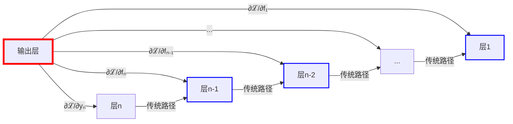
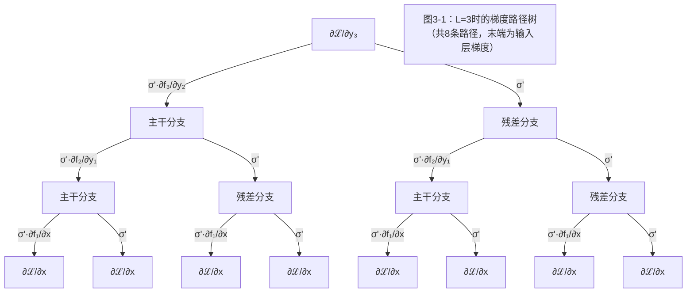
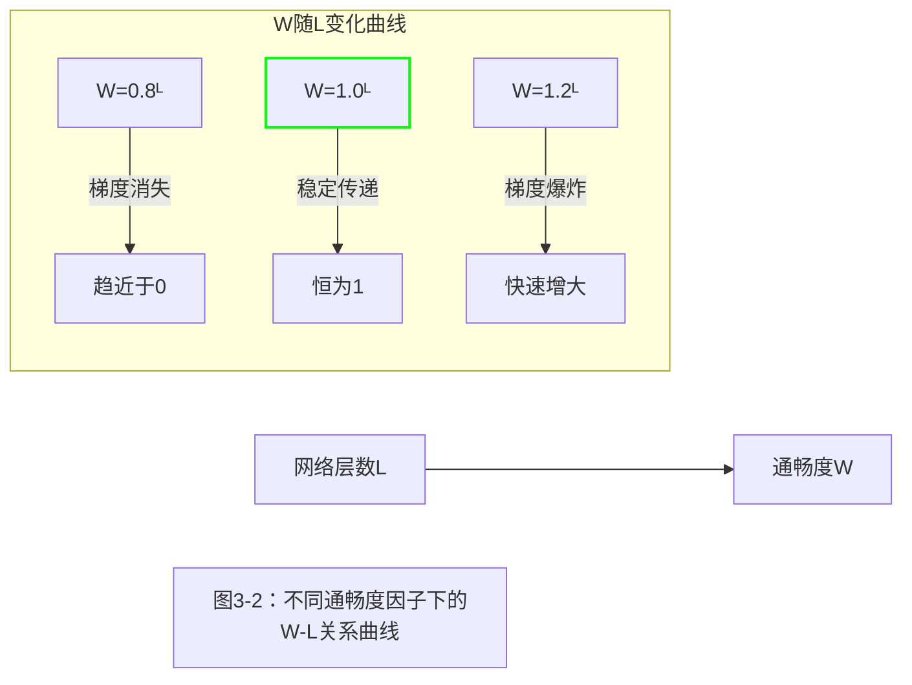
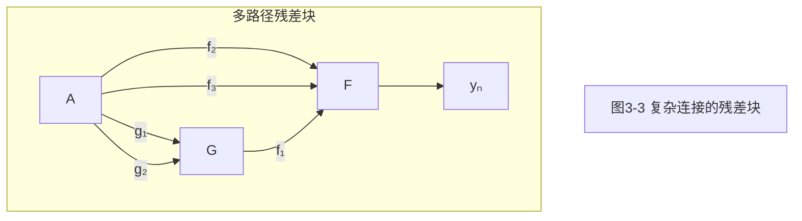

# 残差连接的图论表述：数学建模残差连接并提出设计指标

# (立项说明书)


> 深度学习需要由经验主义走向科学主义

## 1. 引言：研究背景
残差连接(Residual Connection)是深度学习领域的重要创新：
- 缓解深层网络训练的梯度消失/爆炸问题
- 催生了ResNet、Transformer等新型架构
- 在各类任务中展现出鲁棒性和较高性能

**核心疑点**：

为何如此简单的结构`y = F(x) + x`能显著优化深层网络训练问题？为何大部分改进方案收益有限？

本研究提出以梯度计算图解析为核心的**统一解释框架**，揭示残差连接的深层工作原理。

## 2. 理论框架：图论视角的残差连接

### 2.1 数学推导残差连接的图本质
无嵌套函数残差块数学表达：
```
yₙ = fₙ(yₙ₋₁) + yₙ₋₁
```

递归展开残差项`yₙ₋₁`至输入层：
```
yₙ = fₙ(yₙ₋₁) + fₙ₋₁(yₙ₋₂) + ... + f₁(y₁) + y₁
```

即
```
yₙ = Σᵢ₌₁ⁿ fᵢ(yᵢ₋₁) + x
```
**总结：简单残差连接**：
- 第`n`层的输出是所有前序层函数`fᵢ`与初始输入的**叠加和**
- 打破了传统链式梯度传递，创建**跨层直连通**梯度信息传递通道
- 构建了一个**边数约为 $$\frac{n^2}{2}$$ 的梯度计算图**，有向无环
- 所有边权值**均为1**

### 2.2 标准残差块递归推导
事实上，`yₙ = fₙ(yₙ₋₁) + yₙ₋₁`是残差块简化后的数学表示，标准残差连接应为`yₙ = gₙ(fₙ(yₙ₋₁) + yₙ₋₁)`,如`yₙ = ReLu(fₙ(yₙ₋₁) + yₙ₋₁)`。

```
yₙ = gₙ(fₙ(yₙ₋₁) + yₙ₋₁)
```

递归展开残差项`yₙ₋₁`至输入层：
```
yₙ = gₙ(fₙ(yₙ₋₁) + gₙ₋₁(fₙ₋₁(yₙ₋₂) + gₙ₋₁(...(f₁(y₁) + y₁))))
```

**总结：标准残差连接**
- 拥有与`yₙ = fₙ(yₙ₋₁) + yₙ₋₁`残差连接相同的图结构
- 由于嵌套激活函数，**边权不为1**
- 残差连接仍可能存在梯度消失风险，恒等映射并不存在

### 2.3 梯度传播图的构建


**图结构特性**：
1. **高连接密度**：输出层与所有前层建立了梯度路径
2. **稠密连接拓扑**：形成类似全连接图的拓扑结构


### 2.4 图结构优势分析

| 特性 | 机制         | 网络效应 |
|------|------------|----------|
| **梯度传播优化** | 多条权值被稀释的路径 | 缓解梯度消失/爆炸问题 |
| **收敛加速** | 并行梯度传播路径   | 梯度信息传递带宽提升 |
| **结构鲁棒性** | 高度冗余连接     | 容忍层剪枝/随机失效 |
| **普适高性能** | 稠密连接+简单运算  | 跨任务稳定优异表现 |

> **理论突破**：残差连接通过隐式构建**稠密梯度传播径图**，大大提升梯度信息传递效率。


## 3. 多叉树展开梯度计算图

### 3.1 多叉树结构的数学推导与拓扑特性
标准残差块`yₙ = σ(fₙ(yₙ₋₁) + yₙ₋₁)`的梯度传播呈现**二叉树递归展开特性**。根据链式法则，损失函数对第`n-1`层输出的梯度`∂ℒ/∂yₙ₋₁`可分解为：
$$\partial\mathcal{L}/\partial y_{n-1} = \partial\mathcal{L}/\partial y_n \cdot \sigma' \cdot \partial f_n/\partial y_{n-1} + \partial\mathcal{L}/\partial y_n \cdot \sigma'$$
其中第一项对应**主干路径**（经`fₙ`），第二项对应**残差路径**（直接跳连）。

每堆叠一层残差块，梯度路径数呈指数增长（第`L`层时为`2ᴸ`条），形成**完全二叉树拓扑**。以`L=3`为例，路径结构如下：

**拓扑核心**：树的深度对应网络层数，每个非叶节点的两个子节点分别代表主干/残差路径的梯度分量。


### 3.2 激活函数对路径衰减的定量分析
激活函数导数直接决定路径衰减强度，定义：
- `σ'`：输出层激活函数导数（如ReLU在`x>0`时为1，tanh导数≤1）
- `σ₁'`：`fₙ`内部激活函数导数（如ReLU为0或1，Swish导数≈0.5）

单条路径的衰减量为各层导数乘积：
- 经`m`个主干路径的衰减量：`(σ'·σ₁')ᵐ · (σ')ᴸ⁻ᵐ = (σ')ᴸ · (σ₁')ᵐ`

**结论**：残差路径通过减少激活函数嵌套（`m=0`）显著降低衰减，而主干路径的衰减程度取决于`σ₁'`的累积效应。


### 3.3 通畅度W的建模：梯度传递效率的量化指标
**通畅度W**定义为所有梯度路径衰减量的总和，是衡量网络梯度传递效率的核心指标。基于二项式定理推导：
$$W = \sum_{m=0}^{L} \binom{L}{m} \cdot (σ'·σ₁')^m \cdot (σ')^{L-m} = [σ'·(1+σ₁')]^L$$

其数学意义可通过图像直观展示：


**物理意义**：
- 当`σ'·(1+σ₁')=1`时，W恒为1，梯度无累积衰减（理想状态）
- 当该值<1时，W随深度指数衰减（梯度消失风险）
- 当该值>1时，W随深度指数增长（梯度爆炸风险）

### 3.3 推广至多项式：建模复杂连接网络
当残差块中存在**3条及以上梯度路径**（如多分支卷积、并行变换模块）时，梯度传播路径呈现多项式展开特性，可通过多项式模型统一描述。

#### 多项式通畅度推广

定义各路径衰减因子：第 $i$分支为 $\sigma_i'$（ $\sigma_i'$为分支内部激活导数）。  
经 $L$层后，通畅度 $W$推广为多项式展开形式：
$$W = \left(\sum_{i=1}^k \sigma_i'\right)^L$$

#### 多路径残差块结构示意图



## 4 理论体系建立

### 4.1 定义：

> 假设存在一个残差网络，由 $\mathcal{num-layers}$ 个形制相同的残差块堆叠而成，每个残差块包含 $\mathcal{num-paths}$ 条梯度路径

#### 定义1: 路径通畅度

一个残差块中的一条梯度路径的通畅度，解释为该前向传播路径中，梯度值的绝对值。

数学表示：

$$w_p = \left| \frac{\partial \phi_p}{\partial x} \right|$$


#### 定义2：层通畅度

一个残差块的通畅度，解释为该残差块中，所有路径的路径通畅度的和。

数学表示：

$$W_l = \sum_{p \in \mathcal{num-paths}} w_p$$

#### 定义3：总通畅度

整个残差网络的通畅度，解释为该残差网络中，所有残差块的层通畅度的乘积。

数学表示：

$$W = \prod_{l \in \mathcal{num-layers}} W_l$$


解释为该残差网络中，所有残差块的层通畅度的乘积


