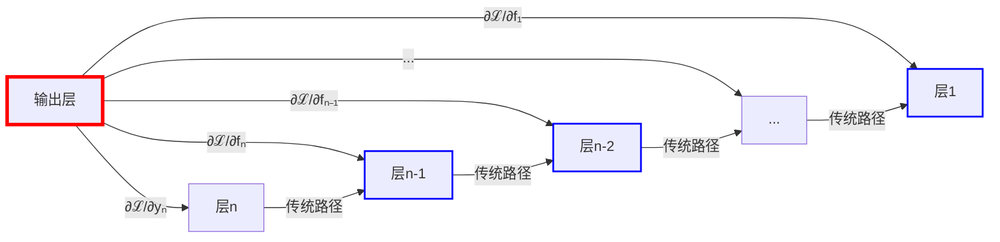
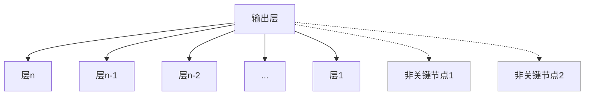
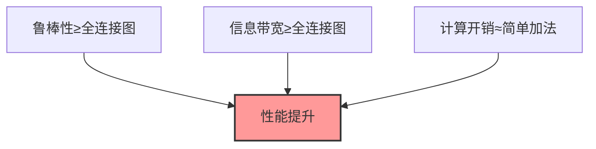
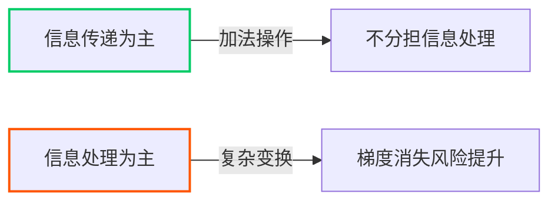
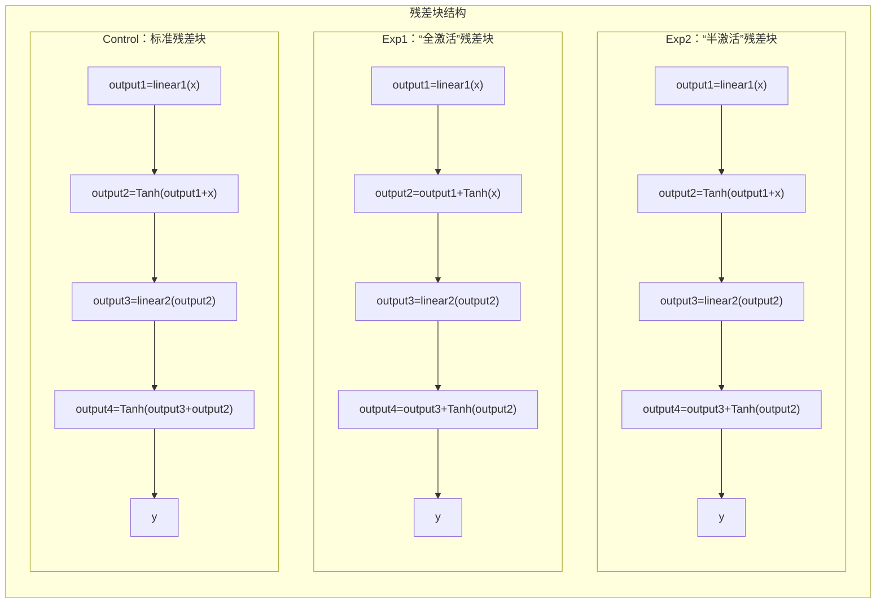

# 残差连接的图论表述：机制分析与优化边界

本文提出残差连接的图论形式化框架，从**梯度计算图拓扑**视角统一解释其工作机制、优势本质与改进局限，并通过受控实验验证理论预测：

## 1. 引言：研究背景
残差连接(Residual Connection)是深度学习领域的重要创新：
- 缓解深层网络训练的梯度消失/爆炸问题
- 催生了ResNet、Transformer等新型架构
- 在各类任务中展现出鲁棒性和较高性能

**核心疑点**：

为何如此简单的结构（`y = F(x) + x`）能显著优化深层网络训练问题？为何大部分改进方案收益有限？

本研究提出以梯度计算图解析为核心的**统一解释框架**，揭示残差连接的深层工作原理。

## 2. 理论框架：图论视角的残差连接

### 2.1 数学推导残差连接的图本质
残差块数学表达：
```
yₙ = fₙ(yₙ₋₁) + yₙ₋₁
```

递归展开残差项`yₙ₋₁`至输入层：
```
yₙ = fₙ(yₙ₋₁) + fₙ₋₁(yₙ₋₂) + ... + f₁(y₁) + y₁
```

即
```
yₙ = Σᵢ₌₁ⁿ fᵢ(yᵢ₋₁) + x
```

**信息总结**：
- 第`n`层的输出是所有前序层函数`fᵢ`与初始输入的**叠加和**
- 打破了传统链式梯度传递，创建**跨层直连通**梯度信息传递通道
- 构建了一个**边数约为 $$\frac{n^2}{2}$$ 的梯度计算图**，有向无环

### 2.2 梯度传播图的构建


**图结构特性**：
1. **高连接密度**：输出层与所有前层建立直接梯度路径
2. **等权短路径**：残差梯度路径权值约为1（考虑实际精度损失）
3. **稠密连接拓扑**：形成类似全连接图的拓扑结构

### 2.3 图结构优势分析

| 特性 | 机制 | 网络效应 |
|------|------|----------|
| **梯度传播优化** | 多条权值为1的短路径 | 缓解梯度消失/爆炸问题 |
| **收敛加速** | 并行梯度传播路径 | 梯度信息传递带宽提升 |
| **结构鲁棒性** | 高度冗余连接 | 容忍层剪枝/随机失效 |
| **普适高性能** | 稠密连接+简单运算 | 跨任务稳定优异表现 |

> **理论突破**：残差连接通过隐式构建**稠密等权短路径图**，在信息传递效率与计算复杂度间接近**最优解**

## 3. 理论预测的改进困境

### 3.1 拓扑连接饱和
原始残差连接已构建接近全连接的梯度图：
- 关键节点（功能层）间均存在直接路径
- 新增连接多为冗余（连接非关键节点）



### 3.2 现有改进尝试的理论分析

| 改进方向       | 图论解释                 | 根本困境                     |
|----------------|--------------------------|------------------------------|
| **动态权重**   | 调整边权值(≠1)           | 未改变连接性，引入优化复杂度 |
| **增加新路径** | 添加冗余边               | O(L²)计算复杂度 vs 原始O(L)  |
| **复杂操作**   | 在边上添加计算节点       | 破坏权值为1的核心优势        |

**优化三角约束**：

任何改进需要满足三个约束，而原始设计已接近该边界的最优解

> **只有找到失败的原因，才能明确成功的方向**

## 4. 实验设计：验证理论框架

### 4.1 核心假设
虽然原始设计接近最优，但仍存在：


**科学问题**：
让残差边承担非线性变换，能否减轻主干道的梯度消失风险？

### 4.2 实验设计

在强梯度消失环境（Tanh激活）中测试三种残差块变体：

1. **实验组1：** 让残差边承担所有非线性变换工作，主干道只有线性变换功能
2. **实验组2：** 让残差边承担一半的非线性变换工作，主干道保有一半非线性变换功能
3. **对照组：** 原始残差实现，残差边只负责信息传递。

> 实验组与对照组在图视角下的本质区别：yₙ = fₙ(yₙ₋₁) + tanh(yₙ₋₁)的残差连接方式，在递归展开时使残差边嵌套多层tanh()，分担指数级梯度下降风险



**关键变量**：
- 非线性变换（Tanh）在主干道和残差边的分布
- 使用Tanh模拟强梯度消失环境

## 5. 实验结果与理论解释

### 5.1 性能对比（20层残差块，50epoch）

| loss&Acc     | 对照组 | 实验组1 | 实验组2 |
|--------------|--------|---------|---------|
| 10轮    | 1.7462/35.27% | 1.5791/41.95%  | 1.6451/40.73%  |
| 20轮    | 1.3084/46.04% | 1.1911/50.64%  | 1.2559/49.87%  |
| 30轮    | 1.0995/49.80% | 0.9734/50.00%  | 1.0549/50.29%  |
| 50轮    | 0.8614/50.01% | 0.7265/52.16%  | 0.8413/50.64%  |
| Max_Acc  | 51.20% | 52.49%  | 51.55%  |
| 坏死神经元率 | 0.21%    | 0.02%     | 0.08%     |

### 5.2 关键发现的理论解释

1. **梯度消失环境下的优势转移**
- 50轮Loss&max_Acc

   | 残差块层数 | 对照组 | 实验组1 | 实验组2 |
   |------|--------|---------|---------|
   | 15层 | 0.7826/51.44% | **0.6698/53.12%**  | 0.7145/52.30%  |
   | 25层 | 0.9536/50.68% | 0.7991/51.85%  | 0.9184/51.06%  |
   | 50层 | 1.0808/48.07% | **1.4391/21.82%**  | 1.1236/48.24%  |

   - 在残差块堆叠20层时，让残差边分担处理任务优化了信息处理分布，损失下降速度与准确率有所提升。
   - 在残差块堆叠50层时，实验组的残差边堆叠过多激活函数，残差边信息传递功能失效，导致非线性变换难以学习。
   - 尽管对照组在50层时相比25层性能有所下降，但权值为1的残差边仍确保信息梯度信息传递至浅层。
   - **图论视角**：在关键边上添加处理节点，在特殊环境下可能提升残差性能，但在极端环境下也可能使残差边失效。

> 此处层表示残差块个数n，单个残差块包含两个全连接层和两个激活函数。模型全连接层个数为2n+2，激活函数个数为2n+1，归一化层个数为2n+1。当残差块层数n=50时，全连接层个数为102，激活函数个数为101，归一化层个数为101。

1. **梯度范数与性能的解耦**
   - 在25层残差块之前，对照组梯度范数最大，但实验组性能更好
   - 在50层残差块时，实验组1梯度范数最大，但对照组性能更好
   - **梯度范数与性能解耦**：证明梯度范数≠性能
   - **信息量与信息质量解耦**：证明信息量≠信息质量

2. **鲁棒性保持**
   - 所有变体坏死神经元率≈0%
   - **理论验证**：残差图的核心优势（保活机制）在各种设计中都保持

### 5.3 ReLU环境下的反向验证
当切换回ReLU（低梯度消失风险）：
```
对照组 = 实验组2 > 实验组1（0.4%）
```
**理论符合**：在低梯度消失风险时，原残差连接的信息传递优势略微提升训练速度，但性能差距微小。

### 5.4 实验总结
信息传递与处理具有不兼容性，承担更多的信息处理职能会造成**梯度信息传播闭塞**，而不承担信息处理职能又会导致**梯度消失风险集中分布**，信息处理与传递的职能分布将影响神经网络的最终性能。
在20层时实验组凭借分担主干信息处理压力表现良好，但在50层由于残差边堆叠的激活函数，导致残差边失效。

> 证明了在不增加额外消耗的情况下，在特定环境中，仅修改图结构能使残差连接性能达到原始设计的104%。

## 6. 结论与展望

### 6.1 理论贡献
1. **统一解释框架**：在统一的理论框架下解释残差连接的性质与现象
2. **看清问题-总结失败**：将改进残差连接的问题抽象为改进图结构设计问题，总结了改进失败原因
3. **具体改进方向提供**：实验发现，修改信息处理与信息传递的功能分布，可能增强残差连接

### 6.2 未来方向
1. **自适应图结构**：根据梯度消失风险动态调整处理分布
2. **异构残差设计**：在网络不同区域应用不同残差连接形式
3. **多领域协同开发**：与高等数学，信息论等领域的新兴理论协同发展

> **残差连接不是终点，而是图结构优化的起点**

## 核心创新点总结

1. **图论框架**：
   - 将残差连接解释为**隐式全连接梯度计算图**
   - 残差梯度图的特性：稠密拓扑、等权短路径

2. **理论突破**：
   - 揭示原始设计接近**优化边界**
   - 指出改进难点，总结失败原因
   - 发现"信息传递与处理"的可调节性

3. **实验设计创新**：
   - 通过激活函数位置调控验证理论
   - 在控制梯度消失环境中实现性能优化
   - 证明梯度范数≠网络性能

4. **新研究方向**：
   - 基于梯度风险的自适应残差结构
   - 异构残差网络设计
   - 多领域理论的协同发展，从多角度，多领域，多层次地优化神经网络

该框架为理解深度学习架构提供了新视角，将网络结构优化问题转化为图结构设计问题，为神经网络架构创新提供思路。


---
具体表述与实验代码与实验结果数据，欢迎[https://github.com/liluoyi666/Graph-Theory-Representation-of-Residual-Connection](https://github.com/liluoyi666/Graph-Theory-Representation-of-Residual-Connection.git)

